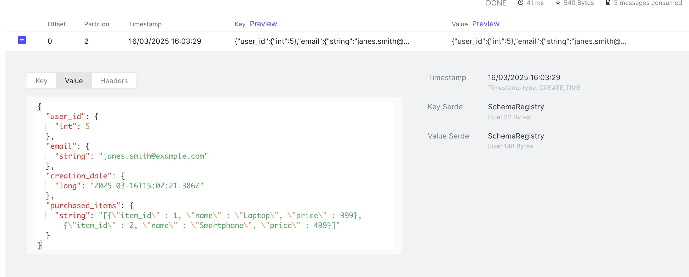
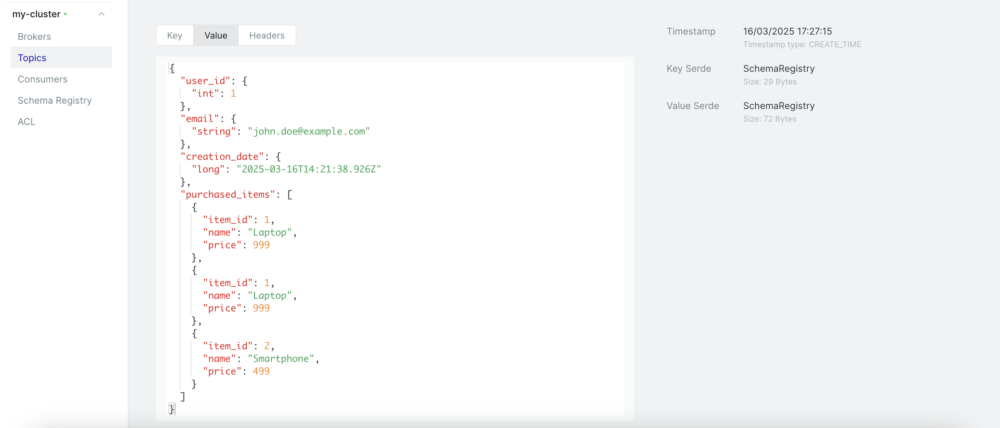
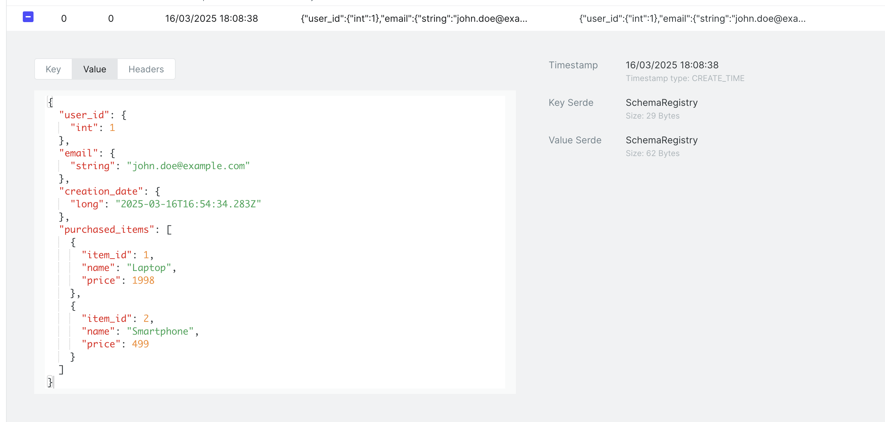
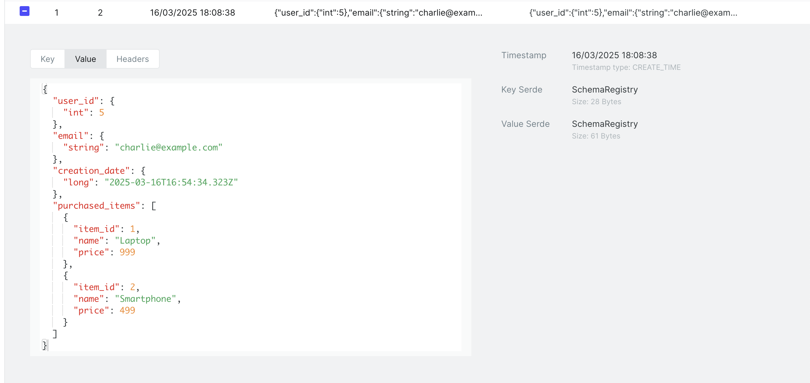
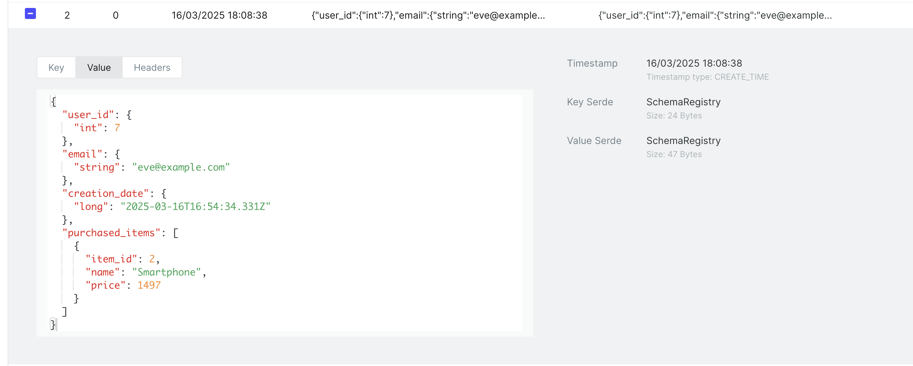

# Check Integrity Transformer

After running the environment :

````shell
$ docker-compose up

$ docker-compose -f docker-compose-connect.yaml up

$ docker-compose -f docker-compose-kafka-ui.yaml up
````

You can check kafka-ui from :
- http://localhost:8090

## Postgres configuration

Now you can configure the database. Enter to the container :

```shell
$ docker exec -it postgres bash
```

### Configure the publication/replication

Now you can access the mysql terminal as root, the password is **password** :

```shell
$ psql -U user -d purchasesdb
```

### Configure the database

And now, let's create a new schema :

```shell
CREATE SCHEMA purchases;
```

And now, let's create a table :

```shell
CREATE TABLE purchases.user (
  id SERIAL PRIMARY KEY, 
  email VARCHAR(100) UNIQUE NOT NULL,
  creation_date TIMESTAMP DEFAULT CURRENT_TIMESTAMP
);
CREATE TABLE purchases.item (
    id SERIAL PRIMARY KEY,
    name VARCHAR(100),
    price INT
);
CREATE TABLE purchases.purchase (
    id SERIAL PRIMARY KEY,
    user_id INT,
    item_id INT,
    purchase_date TIMESTAMP DEFAULT CURRENT_TIMESTAMP,
    FOREIGN KEY (user_id) REFERENCES purchases.user(id),
    FOREIGN KEY (item_id) REFERENCES purchases.item(id)
);
```

```shell
INSERT INTO purchases.user (email) VALUES ('john.doe@example.com');
INSERT INTO purchases.user (email) VALUES ('jane.smith@example.com');
INSERT INTO purchases.user (email) VALUES ('alice@example.com');
INSERT INTO purchases.user (email) VALUES ('bob@example.com');
INSERT INTO purchases.user (email) VALUES ('charlie@example.com');
INSERT INTO purchases.user (email) VALUES ('dave@example.com');
INSERT INTO purchases.user (email) VALUES ('eve@example.com');

INSERT INTO purchases.item (name, price) VALUES ('Laptop', 999);
INSERT INTO purchases.item (name, price) VALUES ('Smartphone', 499);

INSERT INTO purchases.purchase (user_id, item_id) VALUES (1, 1);
INSERT INTO purchases.purchase (user_id, item_id) VALUES (1, 1);
INSERT INTO purchases.purchase (user_id, item_id) VALUES (1, 2);
INSERT INTO purchases.purchase (user_id, item_id) VALUES (2, 1);
INSERT INTO purchases.purchase (user_id, item_id) VALUES (2, 2);
INSERT INTO purchases.purchase (user_id, item_id) VALUES (3, 1);
INSERT INTO purchases.purchase (user_id, item_id) VALUES (3, 2);
INSERT INTO purchases.purchase (user_id, item_id) VALUES (4, 1);
INSERT INTO purchases.purchase (user_id, item_id) VALUES (4, 2);
INSERT INTO purchases.purchase (user_id, item_id) VALUES (5, 1);
INSERT INTO purchases.purchase (user_id, item_id) VALUES (5, 2);
INSERT INTO purchases.purchase (user_id, item_id) VALUES (6, 1);
INSERT INTO purchases.purchase (user_id, item_id) VALUES (6, 2);
INSERT INTO purchases.purchase (user_id, item_id) VALUES (7, 2);
INSERT INTO purchases.purchase (user_id, item_id) VALUES (7, 2);
INSERT INTO purchases.purchase (user_id, item_id) VALUES (7, 2);
```

Let's now create this view :

```sql
CREATE VIEW purchases.user_purchases AS
SELECT u.id AS user_id, u.email, u.creation_date,
       json_agg(
               json_build_object(
                       'item_id', i.id,
                       'name', i.name,
                       'price', i.price
               )
       ) AS purchased_items
FROM purchases.purchase p
         INNER JOIN purchases.user u ON u.id = p.user_id
         INNER JOIN purchases.item i ON p.item_id = i.id
GROUP BY u.id, u.email, u.creation_date;
```

Let's check now :
```shell
purchasesdb-# SELECT * FROM purchases.user_purchases;

 user_id |         email          |       creation_date        |                                                                            purchased_items
---------+------------------------+----------------------------+-----------------------------------------------------------------------------------------------------------------------------------------------------------------------
       5 | charlie@example.com    | 2025-03-16 16:54:34.323895 | [{"item_id" : 1, "name" : "Laptop", "price" : 999}, {"item_id" : 2, "name" : "Smartphone", "price" : 499}]
       4 | bob@example.com        | 2025-03-16 16:54:34.318324 | [{"item_id" : 1, "name" : "Laptop", "price" : 999}, {"item_id" : 2, "name" : "Smartphone", "price" : 499}]
       6 | dave@example.com       | 2025-03-16 16:54:34.327109 | [{"item_id" : 1, "name" : "Laptop", "price" : 999}, {"item_id" : 2, "name" : "Smartphone", "price" : 499}]
       2 | jane.smith@example.com | 2025-03-16 16:54:34.308296 | [{"item_id" : 1, "name" : "Laptop", "price" : 999}, {"item_id" : 2, "name" : "Smartphone", "price" : 499}]
       7 | eve@example.com        | 2025-03-16 16:54:34.331227 | [{"item_id" : 2, "name" : "Smartphone", "price" : 499}, {"item_id" : 2, "name" : "Smartphone", "price" : 499}, {"item_id" : 2, "name" : "Smartphone", "price" : 499}]
       1 | john.doe@example.com   | 2025-03-16 16:54:34.283092 | [{"item_id" : 1, "name" : "Laptop", "price" : 999}, {"item_id" : 1, "name" : "Laptop", "price" : 999}, {"item_id" : 2, "name" : "Smartphone", "price" : 499}]
       3 | alice@example.com      | 2025-03-16 16:54:34.313708 | [{"item_id" : 1, "name" : "Laptop", "price" : 999}, {"item_id" : 2, "name" : "Smartphone", "price" : 499}]
(7 rows)
```

## Connector configuration

### Docker image

If you check the docker compose config from the **docker-compose.yaml** file, you'll notice two topics :
- docker-connect-configs : This topic stores the configurations of our connector (that we will push in the next section)
- docker-connect-offsets : This topic stores the last processed record from the mysql database

### Json String config

You can now push the connector configuration :

````shell
$ curl -i -X POST -H "Accept:application/json" \
  -H "Content-Type:application/json" http://localhost:8083/connectors \
  -d '{
        "name": "jdbc-connector",
        "config": {
            "connector.class": "io.confluent.connect.jdbc.JdbcSourceConnector",  
            "tasks.max": "1",

            "key.converter": "io.confluent.connect.avro.AvroConverter",
            "value.converter": "io.confluent.connect.avro.AvroConverter",
            "key.converter.schema.registry.url": "http://schema-registry:8085",
            "value.converter.schema.registry.url": "http://schema-registry:8085",

            "transforms": "CreateKey,SetSchemaMetadata",
            "transforms.CreateKey.type":"org.apache.kafka.connect.transforms.ValueToKey",
            "transforms.CreateKey.fields": "user_id,email",
            "transforms.SetSchemaMetadata.type":"org.apache.kafka.connect.transforms.SetSchemaMetadata$Value",
            "transforms.SetSchemaMetadata.schema.name": "PurchasesRecords",
            "transforms.SetSchemaMetadata.schema.version": "1",

            "connection.url":"jdbc:postgresql://postgres:5432/purchasesdb",
            "connection.user":"user",
            "connection.password":"password",

            "mode": "timestamp+incrementing",
            "timestamp.column.name": "creation_date",
            "incrementing.column.name": "user_id",

            "numeric.precision.mapping" : "true",
            "numeric.mapping" : "best_fit",

            "query" : "SELECT * FROM (SELECT * FROM purchases.user_purchases) AS PURCHASES_DATA",
            "table.types": "VIEW",

            "poll.interval.ms": "1000", 
            "batch.max.rows": "3000",
            "topic.prefix": "jdbc.connect.view.purchases",
            "db.timezone": "UTC"
          }
      }'
````

You can add the following configuration to the connector to stream only the new data :
- "timestamp.initial": "-1"

To remove the connector :

```shell
curl -X DELETE http://localhost:8083/connectors/jdbc-connector
```

## Checks



If you check now kafka-ui, you'll see the new topic created and the data will have this format :

```json
{
  "user_id": {
    "int": 8
  },
  "email": {
    "string": "janec.smith@example.com"
  },
  "creation_date": {
    "long": "2025-03-16T15:02:21.428Z"
  },
  "purchased_items": {
    "string": "[{\"item_id\" : 1, \"name\" : \"Laptop\", \"price\" : 999}, {\"item_id\" : 2, \"name\" : \"Smartphone\", \"price\" : 499}]"
  }
}
```

The value schema registry has the following schema :

```json
{
  "type": "record",
  "name": "PurchasesRecords",
  "fields": [
    {
      "name": "user_id",
      "type": [
        "null",
        "int"
      ],
      "default": null
    },
    {
      "name": "email",
      "type": [
        "null",
        "string"
      ],
      "default": null
    },
    {
      "name": "creation_date",
      "type": [
        "null",
        {
          "type": "long",
          "connect.version": 1,
          "connect.name": "org.apache.kafka.connect.data.Timestamp",
          "logicalType": "timestamp-millis"
        }
      ],
      "default": null
    },
    {
      "name": "purchased_items",
      "type": [
        "null",
        "string"
      ],
      "default": null
    }
  ],
  "connect.version": 1,
  "connect.name": "PurchasesRecords"
}
```

The purchased_items is a string and not an AVRO object. We will fix this in the next section.

### Json Avro config

You can now push the connector configuration :

````shell
$ curl -i -X POST -H "Accept:application/json" \
  -H "Content-Type:application/json" http://localhost:8083/connectors \
  -d '{
        "name": "jdbc-connector",
        "config": {
            "connector.class": "io.confluent.connect.jdbc.JdbcSourceConnector",  
            "tasks.max": "1",

            "key.converter": "io.confluent.connect.avro.AvroConverter",
            "value.converter": "io.confluent.connect.avro.AvroConverter",
            "key.converter.schema.registry.url": "http://schema-registry:8085",
            "value.converter.schema.registry.url": "http://schema-registry:8085",

            "transforms": "CreateKey,PurchaseItemToArray,SetSchemaMetadata",
            "transforms.CreateKey.type":"org.apache.kafka.connect.transforms.ValueToKey",
            "transforms.CreateKey.fields": "user_id,email",
            "transforms.PurchaseItemToArray.type":"org.example.json.transformers.PurchaseItemToArray$Value",
            "transforms.PurchaseItemToArray.field": "purchased_items",
            "transforms.SetSchemaMetadata.type":"org.apache.kafka.connect.transforms.SetSchemaMetadata$Value",
            "transforms.SetSchemaMetadata.schema.name": "PurchasesRecords",
            "transforms.SetSchemaMetadata.schema.version": "1",

            "connection.url":"jdbc:postgresql://postgres:5432/purchasesdb",
            "connection.user":"user",
            "connection.password":"password",

            "mode": "timestamp+incrementing",
            "timestamp.column.name": "creation_date",
            "incrementing.column.name": "user_id",

            "numeric.precision.mapping" : "true",
            "numeric.mapping" : "best_fit",

            "query" : "SELECT * FROM (SELECT * FROM purchases.user_purchases) AS PURCHASES_DATA",
            "table.types": "VIEW",

            "poll.interval.ms": "1000", 
            "batch.max.rows": "3000",
            "topic.prefix": "jdbc.connect.view.purchases",
            "db.timezone": "UTC"
          }
      }'
````

You can add the following configuration to the connector to stream only the new data :
- "timestamp.initial": "-1"

To remove the connector :

```shell
curl -X DELETE http://localhost:8083/connectors/jdbc-connector
```

## Checks



If you check now kafka-ui, you'll see the new topic created and the data will have this format :

```json
{
  "user_id": {
    "int": 2
  },
  "email": {
    "string": "jane.smith@example.com"
  },
  "creation_date": {
    "long": "2025-03-16T14:21:40.286Z"
  },
  "purchased_items": [
    {
      "item_id": 1,
      "name": "Laptop",
      "price": 999
    },
    {
      "item_id": 2,
      "name": "Smartphone",
      "price": 499
    }
  ]
}
```

The value schema registry has the following schema :

```json
{
  "type": "record",
  "name": "PurchasesRecords",
  "fields": [
    {
      "name": "user_id",
      "type": [
        "null",
        "int"
      ],
      "default": null
    },
    {
      "name": "email",
      "type": [
        "null",
        "string"
      ],
      "default": null
    },
    {
      "name": "creation_date",
      "type": [
        "null",
        {
          "type": "long",
          "connect.version": 1,
          "connect.name": "org.apache.kafka.connect.data.Timestamp",
          "logicalType": "timestamp-millis"
        }
      ],
      "default": null
    },
    {
      "name": "purchased_items",
      "type": {
        "type": "array",
        "items": {
          "type": "record",
          "name": "items",
          "fields": [
            {
              "name": "item_id",
              "type": "int"
            },
            {
              "name": "name",
              "type": "string"
            },
            {
              "name": "price",
              "type": "int"
            }
          ],
          "connect.name": "items"
        }
      }
    }
  ],
  "connect.version": 1,
  "connect.name": "PurchasesRecords"
}
```

The purchased_items is an AVRO object now.

### Merged Json Avro config

You can now push the connector configuration :

````shell
$ curl -i -X POST -H "Accept:application/json" \
  -H "Content-Type:application/json" http://localhost:8083/connectors \
  -d '{
        "name": "jdbc-connector",
        "config": {
            "connector.class": "io.confluent.connect.jdbc.JdbcSourceConnector",  
            "tasks.max": "1",

            "key.converter": "io.confluent.connect.avro.AvroConverter",
            "value.converter": "io.confluent.connect.avro.AvroConverter",
            "key.converter.schema.registry.url": "http://schema-registry:8085",
            "value.converter.schema.registry.url": "http://schema-registry:8085",

            "transforms": "CreateKey,MergedPurchaseItemToArray,SetSchemaMetadata",
            "transforms.CreateKey.type":"org.apache.kafka.connect.transforms.ValueToKey",
            "transforms.CreateKey.fields": "user_id,email",
            "transforms.MergedPurchaseItemToArray.type":"org.example.json.transformers.MergedPurchaseItemToArray$Value",
            "transforms.MergedPurchaseItemToArray.field": "purchased_items",
            "transforms.SetSchemaMetadata.type":"org.apache.kafka.connect.transforms.SetSchemaMetadata$Value",
            "transforms.SetSchemaMetadata.schema.name": "PurchasesRecords",
            "transforms.SetSchemaMetadata.schema.version": "1",

            "connection.url":"jdbc:postgresql://postgres:5432/purchasesdb",
            "connection.user":"user",
            "connection.password":"password",

            "mode": "timestamp+incrementing",
            "timestamp.column.name": "creation_date",
            "incrementing.column.name": "user_id",

            "numeric.precision.mapping" : "true",
            "numeric.mapping" : "best_fit",

            "query" : "SELECT * FROM (SELECT * FROM purchases.user_purchases) AS PURCHASES_DATA",
            "table.types": "VIEW",

            "poll.interval.ms": "1000", 
            "batch.max.rows": "3000",
            "topic.prefix": "jdbc.connect.view.purchases",
            "db.timezone": "UTC"
          }
      }'
````

You can add the following configuration to the connector to stream only the new data :
- "timestamp.initial": "-1"

To remove the connector :

```shell
curl -X DELETE http://localhost:8083/connectors/jdbc-connector
```

## Checks

User Number 1 :

```shell
INSERT INTO purchases.user (email) VALUES ('john.doe@example.com');

INSERT INTO purchases.item (name, price) VALUES ('Laptop', 999);
INSERT INTO purchases.item (name, price) VALUES ('Smartphone', 499);

INSERT INTO purchases.purchase (user_id, item_id) VALUES (1, 1);
INSERT INTO purchases.purchase (user_id, item_id) VALUES (1, 1);
INSERT INTO purchases.purchase (user_id, item_id) VALUES (1, 2);
```



User Number 5 :

```shell
INSERT INTO purchases.user (email) VALUES ('charlie@example.com');

INSERT INTO purchases.purchase (user_id, item_id) VALUES (5, 1);
INSERT INTO purchases.purchase (user_id, item_id) VALUES (5, 2);
```



User Number 7 :

```shell
INSERT INTO purchases.user (email) VALUES ('eve@example.com');

INSERT INTO purchases.purchase (user_id, item_id) VALUES (7, 2);
INSERT INTO purchases.purchase (user_id, item_id) VALUES (7, 2);
INSERT INTO purchases.purchase (user_id, item_id) VALUES (7, 2);
```



If you check now kafka-ui, you'll see the new topic created and the data key will have this format :

```json
{
  "type": "record",
  "name": "ConnectDefault",
  "namespace": "io.confluent.connect.avro",
  "fields": [
    {
      "name": "user_id",
      "type": [
        "null",
        "int"
      ],
      "default": null
    },
    {
      "name": "email",
      "type": [
        "null",
        "string"
      ],
      "default": null
    }
  ]
}
```

The value schema registry has the following schema :

```json
{
  "type": "record",
  "name": "PurchasesRecords",
  "fields": [
    {
      "name": "user_id",
      "type": [
        "null",
        "int"
      ],
      "default": null
    },
    {
      "name": "email",
      "type": [
        "null",
        "string"
      ],
      "default": null
    },
    {
      "name": "creation_date",
      "type": [
        "null",
        {
          "type": "long",
          "connect.version": 1,
          "connect.name": "org.apache.kafka.connect.data.Timestamp",
          "logicalType": "timestamp-millis"
        }
      ],
      "default": null
    },
    {
      "name": "purchased_items",
      "type": {
        "type": "array",
        "items": {
          "type": "record",
          "name": "items",
          "fields": [
            {
              "name": "item_id",
              "type": "int"
            },
            {
              "name": "name",
              "type": "string"
            },
            {
              "name": "price",
              "type": "int"
            }
          ],
          "connect.name": "items"
        }
      }
    }
  ],
  "connect.version": 1,
  "connect.name": "PurchasesRecords"
}
```

The purchased_items is a MERGED AVRO object now.


