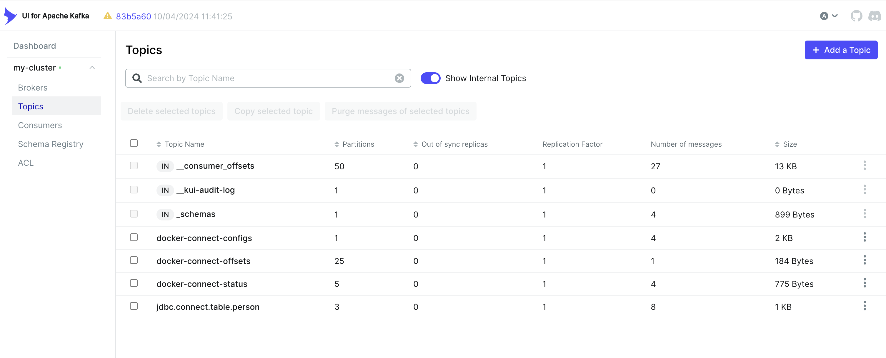
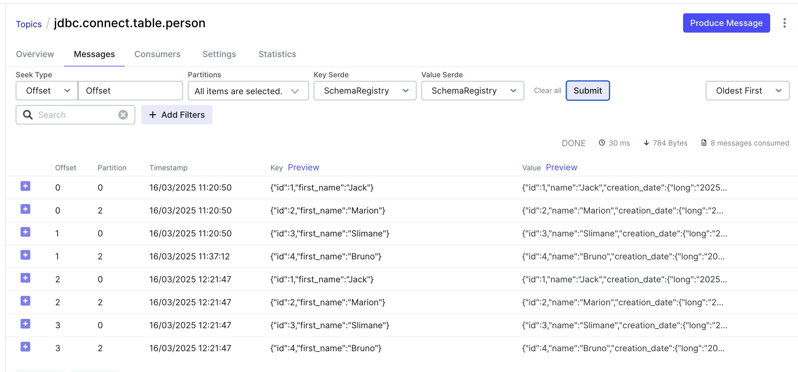

# Check Integrity Transformer

After running the environment :

````shell
$ docker-compose up

$ docker-compose -f docker-compose-connect.yaml up

$ docker-compose -f docker-compose-kafka-ui.yaml up -d
````

You can check kafka-ui from :
- http://localhost:8090

## Postgres configuration

Now you can configure the database. Enter to the container :

```shell
$ docker exec -it postgres bash
```

### Configure the publication/replication

Now you can access the mysql terminal as root, the password is **password** :

```shell
$ psql -U user -d personsdb
```

### Configure the persons table

And now, let's create a new schema :

```shell
CREATE SCHEMA persons;
```

And now, let's create a table :

```shell
CREATE TABLE persons.person (
  id SERIAL PRIMARY KEY, 
  name VARCHAR(255) UNIQUE NOT NULL,
  age INT, 
  creation_date TIMESTAMP DEFAULT CURRENT_TIMESTAMP
);
INSERT INTO persons.person (name, age) VALUES ('Jack', 14);
INSERT INTO persons.person (name, age) VALUES ('Marion', 28);
INSERT INTO persons.person (name, age) VALUES ('Slimane', 35);
```

Let's check now :

```shell
personsdb=# SELECT * FROM persons.person;
 id |  name   | age |       creation_date
----+---------+-----+----------------------------
  1 | Jack    |  14 | 2025-03-14 19:12:03.303792
  2 | Marion  |  28 | 2025-03-14 19:12:03.327469
  3 | Slimane |  35 | 2025-03-14 19:12:04.481378
(3 rows)
```

## Connector configuration

### Docker image

If you check the docker compose config from the **docker-compose.yaml** file, you'll notice two topics :
- docker-connect-configs : This topic stores the configurations of our connector (that we will push in the next section)
- docker-connect-offsets : This topic stores the last processed record from the mysql database

### Push your config

You can now push the connector configuration :

````shell
````shell
$ curl -i -X POST -H "Accept:application/json" \
  -H "Content-Type:application/json" http://localhost:8083/connectors \
  -d '{
        "name": "jdbc-connector",
        "config": {
            "connector.class": "io.confluent.connect.jdbc.JdbcSourceConnector",  
            "tasks.max": "1",

            "key.converter": "io.confluent.connect.avro.AvroConverter",
            "value.converter": "io.confluent.connect.avro.AvroConverter",
            "key.converter.schema.registry.url": "http://schema-registry:8085",
            "value.converter.schema.registry.url": "http://schema-registry:8085",

            "transforms": "ApplyIdentityVal,CreateKey,IntegrityCheck,RenameFieldVal,RenameFieldKey,ApplyIdentityKey,SetSchemaMetadata",
            "transforms.ApplyIdentityVal.type":"org.example.simple.tranformers.Identity$Value",
            "transforms.CreateKey.type":"org.apache.kafka.connect.transforms.ValueToKey",
            "transforms.CreateKey.fields": "id,name",
            "transforms.IntegrityCheck.type":"org.example.simple.tranformers.IntegrityCheck$Value",
            "transforms.IntegrityCheck.field": "integrity",
            "transforms.RenameFieldVal.type":"org.example.simple.tranformers.RenameField$Value",
            "transforms.RenameFieldVal.field.current": "integrity",
            "transforms.RenameFieldVal.field.new": "sha256",
            "transforms.RenameFieldKey.type":"org.example.simple.tranformers.RenameField$Key",
            "transforms.RenameFieldKey.field.current": "name",
            "transforms.RenameFieldKey.field.new": "first_name",
            "transforms.ApplyIdentityKey.type":"org.example.simple.tranformers.Identity$Key",
            "transforms.SetSchemaMetadata.type":"org.apache.kafka.connect.transforms.SetSchemaMetadata$Value",
            "transforms.SetSchemaMetadata.schema.name": "PersonsRecords",
            "transforms.SetSchemaMetadata.schema.version": "1",

            "connection.url":"jdbc:postgresql://postgres:5432/personsdb",
            "connection.user":"user",
            "connection.password":"password",

            "mode": "timestamp+incrementing",
            "timestamp.column.name": "creation_date",
            "incrementing.column.name": "id",

            "numeric.precision.mapping" : "true",
            "numeric.mapping" : "best_fit",

            "query" : "SELECT * FROM (SELECT id, name, creation_date FROM persons.person) AS PERSONS_DATA",
            "table.types": "TABLE",

            "poll.interval.ms": "1000", 
            "batch.max.rows": "3000",
            "topic.prefix": "jdbc.connect.table.person",
            "db.timezone": "UTC"
          }
      }'
````

You can add the following configuration to the connector to stream only the new data :
- "timestamp.initial": "-1"

To remove the connector :

```shell
curl -X DELETE http://localhost:8083/connectors/jdbc-connector
```

## Checks





Well, it is not clear for me why the records are duplicated !!!

If you check now kafka-ui, you'll see the new topic created and the data will have this format :

```json
{
  "id": 1,
  "name": "Jack",
  "creation_date": {
    "long": "2025-03-16T10:12:19.362Z"
  },
  "sha256": "e8641a5c228eaae13a584cb11f88712ab61b6cda965e90280daffdf446e56edf"
}
```

You can see the integrity field that has been added to the record. This field is a hash of the record. If you change the record, the hash will change.

The key will have the following format :

```json
{
  "id": 1,
  "first_name": "Jack"
}
```

And the schema registry key will be , jdbc.connect.table.person-key , with the following schema :

```json
{
  "type": "record",
  "name": "ConnectDefault",
  "namespace": "io.confluent.connect.avro",
  "fields": [
    {
      "name": "id",
      "type": "int"
    },
    {
      "name": "first_name",
      "type": "string"
    }
  ]
}
```

The value schema registry will be , jdbc.connect.table.person-value , with the following schema :

```json
{
  "type": "record",
  "name": "PersonsRecords",
  "fields": [
    {
      "name": "id",
      "type": "int"
    },
    {
      "name": "name",
      "type": "string"
    },
    {
      "name": "creation_date",
      "type": [
        "null",
        {
          "type": "long",
          "connect.version": 1,
          "connect.name": "org.apache.kafka.connect.data.Timestamp",
          "logicalType": "timestamp-millis"
        }
      ],
      "default": null
    },
    {
      "name": "sha256",
      "type": "string"
    }
  ],
  "connect.version": 1,
  "connect.name": "PersonsRecords"
}
```


